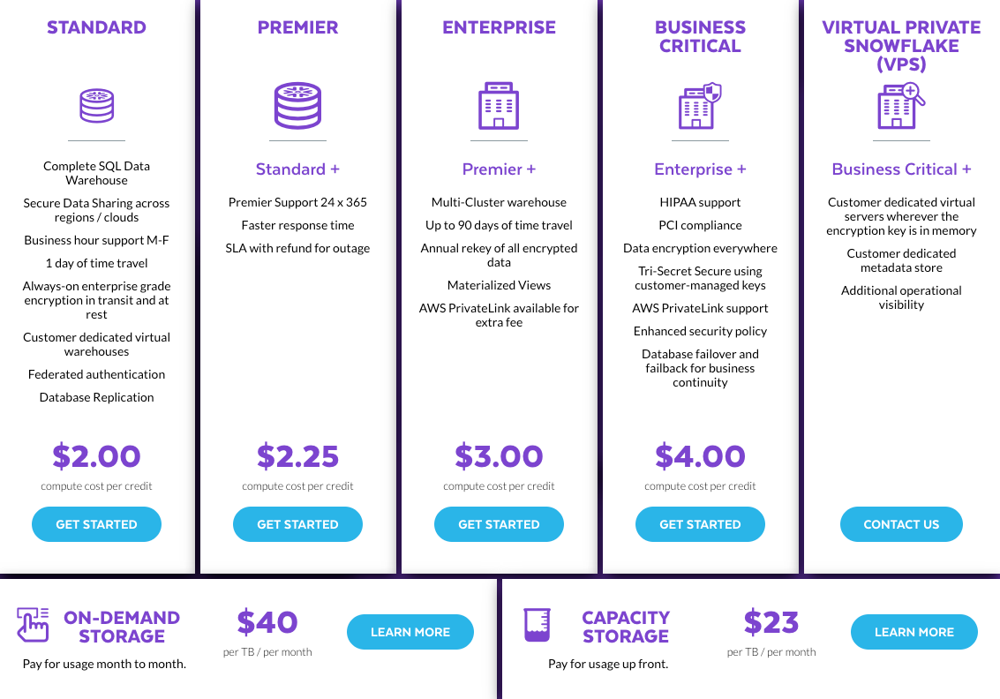
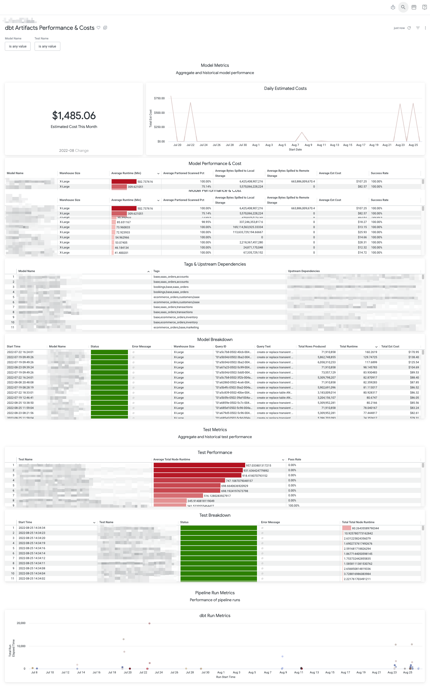

# dbt-snowflake-artifacts

This is a simplified version of the [dbt-artifacts](https://github.com/brooklyn-data/dbt_artifacts/tree/main/macros) package with limited capabilities. For extended functionalities, please do check out the original package.

Hereby we would like to credit creators and contributors of the aformentioned package.

**Note: This is very specific for a Snowflake stack**

## Usage

### Install package

Include this in your `packages.yml` file:

```yml
packages:
  - git: "https://github.com/Hiflylabs/dbt-snowflake-artifacts.git"
    revision: main
```
Load the package

```bash
dbt deps
```

Make sure you include the following configs in your `dbt_project.yml` file:

```yml
on-run-end:
    - "{{ upload_artifacts_wrapper() }}"

models:    
# artifacts destination
      artifacts:
          +schema: artifacts
          materialized: table
          +enabled: "{{ target.name in ['dev', 'prod'] }}"

vars:
  # default business critical (change this according to your package)
  snowflake_contract_rate: "{{ env_var('SNOWFLAKE_CONTRACT_RATE', 4) }}"
```

+ Your Looker role have access to the `_ARTIFACTS` schema

### Change Snowflake contract environmental variable:



**Windows**

```bash
set SNOWFLAKE_CONTRACT_RATE=4
```

**Mac/Linux**

```bash
export SNOWFLAKE_CONTRACT_RATE=4
```

**dbt Cloud**

Go to `Settings` > `Environment Variables` > `Add Variable`

See docs: https://docs.getdbt.com/docs/build/environment-variables

## Included models

```
stg_manifest_nodes
stg_pipeline_runs
stg_query_history
stg_run_results
wh_model_dags_dim
wh_model_performance_fact
wh_pipeline_runs_fact
wh_test_performance_fact
```
## Looker

Add the LookML views in the [views](./looker/views/) folder to your Looker project.

Use [artifacts_dashboard.yml](./looker/dashboards/artifacts_dashboard.yml) to create a LookML derived dashboard.

Refer to: https://cloud.google.com/looker/docs/building-lookml-dashboards

## Example Outcome

Possible metrics:
- Aggregated costs in the warehouse
- Metrics of a dbt run (per model) -- warehouse, runtime, scanned paritions (%), data spill, success rates
- Upstream model dependencies
- Test performance
- Pipeline run performance


